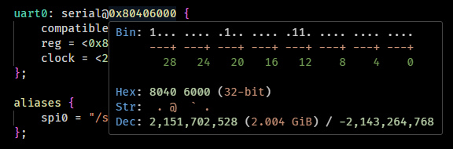
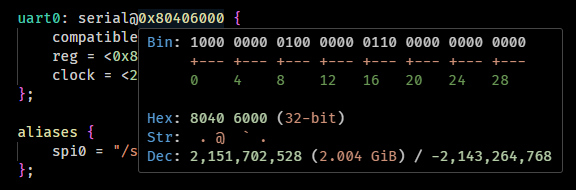
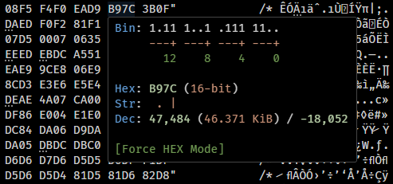

# Bit Peek for Visual Studio Code

     

Bit Peek can display numbers in various forms (binary, hex, decimal, octal, and ASCII) with just a simple hover of your mouse cursor. The display is clean and easy to read. Extension is available on the [Marketplace](https://marketplace.visualstudio.com/items?itemName=dingzhaojie.bit-peek) and [Open VSX Registry](https://open-vsx.org/extension/dingzhaojie/bit-peek), compatible with Visual Studio Code and Arduino IDE 2.x.

## Features

Bit Peek could show bits in an unique "register friendly" mode: all the `0`s will be displayed as `.`, so you can identify the `1`s at a glance:

And it supports both LSB0 (Intel-style) and MSB0 (Motorola-style) bit numbering display:

For octal numbers, Bit Peek will interpret the bits as UNIX file permission when possible:

Bit Peek will try to identify the base of numbers automatically. But if you are analyzing memory dumps, try `Bit Peek: Toggle force HEX mode` command to enforce parsing as hexadecimals:

## Supported Formats

| Name       | Example                                                      |
| ---------- | ------------------------------------------------------------ |
| C/C++      | Hex: `0x1234`, `0x1234U` Oct: `0777` Dec: `1234`, `1234UL` |
| JavaScript | Number: same as C/C++ BigInt: `0x1234n`, `0o777n`, `0b1010n`, `1234n` |
| CSS        | #RGB: `#AABBCC`                                              |
| NASM       | Hex: `0x1234`, `0h1234`, `1234h` Oct: `0o777`, `777o` Bin: `0b1010`, `1010b`, `0b1100_1000` Dec: `0d1234`, `1234d`, `1234` |
| Verilog    | Hex: `h1234`, `sh1234` Oct: `o777`, `so777` Bin: `b1010`, `sb1010`, `b0100_0000_0000` Dec: `1234`, `d1234`, `sd1234`, `25_000_000` |

## Customizations

The hover content is highly configurable to suit your needs. You can customize what information is displayed in the hover tooltip by changing the following settings:

- `bit-peek.showBin`: Show binary value.

  - `bit-peek.registerView`: Show bits in a "register-friendly" mode.
  - `bit-peek.msb0`: Use MSB0 bit numbering (Motorola-style).
  - `bit-peek.groupByBytes`: Group bits by bytes (otherwise by nibbles).
  - `bit-peek.rawBits`: Display raw binary numbers (disable all the bit rendering features).
  - `bit-peek.singleRow`: Display bits in a single row (but Visual Studio Code may still automatically wrap long strings).

- `bit-peek.showHex`: Show hexadecimal value.

  - `bit-peek.showWidth`: Show data bit width.

- `bit-peek.showStr`: Show ASCII characters.

  - `showAsciiCode`: Show ASCII code.

- `bit-peek.showDec`: Show decimal value.

  - `bit-peek.showSize`: Show as capacity (T/G/M/K).

- `bit-peek.forceHex`: Enable "Force HEX" mode.

## Limitations

- For the decimal numbers without base prefix and postfix, it must not begin with `0`, or it will be recognized as octal (C/C++ rule).
- In some languages (C/C++/JavaScript...), the sign of decimal numbers cannot be fetched due to the limitation of Visual Studio Code, so it cannot recognize negative numbers in such case.
