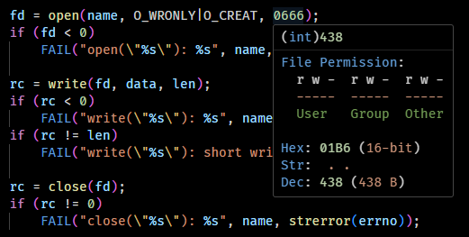

# Bit Peek for Visual Studio Code

Bit Peek can display the binary and other forms (hexadecimal, octal, ASCII) of numbers at mouse cursor in a very easy to read format. Extension is available on the [Marketplace](https://marketplace.visualstudio.com/items?itemName=dingzhaojie.bit-peek).

By default, Bit Peek will show bits in a register friendly mode. In this mode, all `0`s will be displayed as `.`, so you can identify the `1`s at a glance:

Both the bit representation and numbering style are customizable. Set `bit-peek.registerView` to `false` to back to the ordinary mode, set `bit-peek.msb0` to `true` to use MSB0 (Motorola style) bit numbering:

Bit Peek will try to identify the base of numbers automatically. But if you are analyzing hex dumps, you can use `Bit Peek: Toggle force HEX mode` command to enforce parsing as hexadecimals:

If the number looks like an UNIX file permission, Bit Peek will interpret the bits as file permission:

Happy coding. :)
